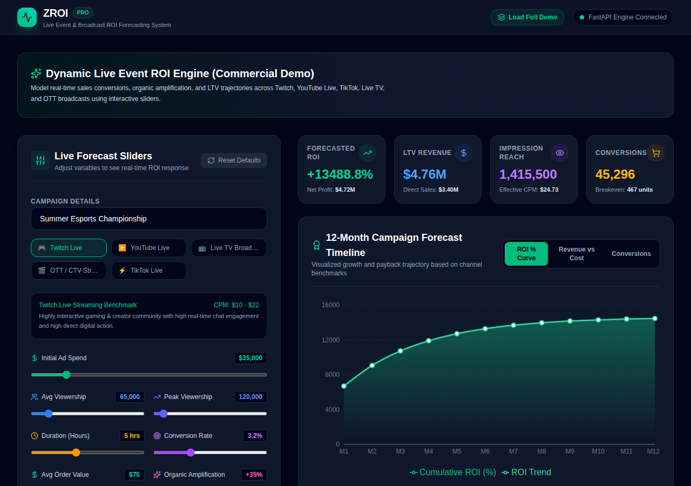

# ZROI — Live Event & Broadcast ROI Forecasting Engine



**ZROI** is a specialized, full-stack ROI modeling and analytics engine built to quantify, predict, and optimize return on investment (ROI) for brand sponsorships and ad spend across live online events (Twitch, YouTube Live, TikTok Live) and linear/OTT broadcast TV (Live Sports, Cable, Connected TV).

---

## 🌟 Executive Overview

Marketing during live events presents unique measurement challenges: audience numbers fluctuate drastically, engagement decays post-broadcast, and traditional attribution models miss the viral tail of social amplification and long-term customer lifetime value (LTV).

**ZROI** bridges this gap by combining live stream telemetry (peak vs. average concurrent viewership, broadcast duration, chat/interactive engagement rate) with custom channel benchmarks to project immediate sales conversions, post-event organic reach, breakeven thresholds, and 12-month cumulative payback trajectories.

---

## ✨ Comprehensive Feature Matrix

### 1. 🎯 Dynamic Live Channel Intelligence
* **Multi-Platform Channel Benchmarks**: Pre-tuned parameters for **Twitch Live**, **YouTube Live**, **TikTok Live**, **Live TV Broadcast**, and **OTT / Connected TV Streaming**.
* **Channel-Specific Turnover & Amplification**:
  * **Twitch**: High chat engagement, strong direct-click conversion, fast organic decay.
  * **YouTube Live**: Balanced live and VOD long-tail value (30-day extended tail).
  * **TikTok Live**: Massive viral coefficient, lower average order value (AOV), rapid audience churn.
  * **Live TV Broadcast**: Massive impression reach, low direct-click conversion, high offline brand lift multiplier.
  * **OTT / CTV**: High completion rates, premium demographic alignment, interactive QR-code attribution.

### 2. ⚡ Real-Time Interactive ROI Engine
* **Instant Dynamic Recalculation**: Adjust ad spend, concurrent viewership, broadcast hours, conversion rates, order value, organic amplification, and LTV multiplier with zero latency.
* **Key Financial Metrics**:
  * **Forecasted ROI %**: Total Net Profit divided by Ad Spend.
  * **Total LTV Revenue**: 12-Month Customer Lifetime Value vs. Immediate Direct Sales.
  * **Impression Reach & Effective CPM**: Calculate cost-per-thousand views adjusted for audience turnover factor.
  * **Breakeven Threshold**: Exact unit sales needed to achieve 100% payback.

### 3. 📈 12-Month Projections & Visual Dashboards
* **ROI Growth Trajectory Chart**: Track cumulative return on ad spend across Month 1 through Month 12.
* **Revenue vs. Cost Visualizer**: Compare total monthly revenue against initial ad expenditure.
* **Conversion & LTV Breakdown Chart**: Visualize immediate vs. recurring customer value over time.

### 4. 💾 Scenario Management & Decision Support
* **Pre-Loaded Commercial Demo Scenarios**:
  * *Summer Esports Championship* (High interaction, streaming focus).
  * *Prime-Time Sports TV Special* (Massive scale TV broadcast).
  * *Influencer Live Shopping Fest* (High-conversion TikTok/YouTube live shopping).
* **Snapshot Stacking**: Save, label, compare, and manage multiple campaign parameter snapshots side-by-side.
* **JSON Export**: Export campaign snapshot models directly into structured JSON for executive deck generation and reporting.

---

## 📐 Mathematical Model & Core Formulae

ZROI utilizes an adjusted linear-turnover model with exponential post-event decay:

1. **Effective Total Views**:
   $$\text{Total Views} = \text{Avg Viewership} \times \text{Duration (Hours)} \times \text{Turnover Factor}$$

2. **Total Impressions (Live + Organic Tail)**:
   $$\text{Total Impressions} = \text{Total Views} \times \left(1 + \frac{\text{Organic Amplification \%}}{100}\right)$$

3. **Direct Sales Conversions**:
   $$\text{Direct Sales} = \text{Total Views} \times \left(\frac{\text{Conversion Rate \%}}{100}\right)$$

4. **Direct & 12-Month LTV Revenue**:
   $$\text{Direct Revenue} = \text{Direct Sales} \times \text{Average Order Value (AOV)}$$
   $$\text{12-Month LTV Revenue} = \text{Direct Revenue} \times \text{LTV Multiplier}$$

5. **Effective CPM & ROI**:
   $$\text{eCPM} = \left(\frac{\text{Ad Spend}}{\text{Total Impressions}}\right) \times 1000$$
   $$\text{ROI \%} = \left(\frac{\text{12-Month LTV Revenue} - \text{Ad Spend}}{\text{Ad Spend}}\right) \times 100$$

---

## 🛠️ System Architecture

```
zroi/
├── backend/                  # FastAPI Python Backend
│   ├── app/
│   │   ├── main.py           # REST API Endpoints & Snapshot router
│   │   ├── models.py         # Pydantic Request/Response Schemas
│   │   └── roi_engine.py     # Deterministic ROI & Channel Benchmark Logic
│   └── tests/                # Pytest Test Suite
│       └── test_roi.py
├── frontend/                 # React + TypeScript + Vite Frontend
│   ├── src/
│   │   ├── components/
│   │   │   ├── ChartsDashboard.tsx  # Interactive Recharts Visualization
│   │   │   ├── SlidersPanel.tsx     # Dynamic Parameter Sliders & Channel Picker
│   │   │   └── SnapshotsPanel.tsx   # Saved Campaign Scenarios & JSON Export
│   │   ├── demoScenarios.ts         # Pre-configured Commercial Demo Presets
│   │   ├── roiCalculator.ts        # Client-side fallback calculation engine
│   │   └── App.tsx                  # Main Workspace Layout
├── docs/                     # Documentation Assets & Screenshots
│   └── screenshots/
│       └── zroi_dashboard.png
├── .github/
│   └── workflows/
│       └── deploy-preview.yml # Automated CI/CD & GitHub Pages Preview Deployment
└── README.md
```

---

## 🚀 Quick Start Guide

### Prerequisites
* **Python**: 3.9+
* **Node.js**: 18+

### 1. Run Backend Service (FastAPI)

```bash
cd backend
python -m venv venv
source venv/bin/activate  # Or `venv\Scripts\activate` on Windows
pip install -r requirements.txt
uvicorn app.main:app --reload --port 8000
```
Backend API interactive documentation will be accessible at: `http://localhost:8000/docs`

### 2. Run Frontend Web Application (React + Vite)

```bash
cd frontend
npm install
npm run dev
```
Open your browser at `http://localhost:3000` to interact with the ZROI application.

---

## 🧪 Testing & Quality Assurance

### Run Python Backend Tests
```bash
cd backend
pytest tests/
```

### Build Frontend Production Distribution
```bash
cd frontend
npm run build
```

---

## 📄 License

Proprietary - All Rights Reserved.
Copyright (c) 2025 ZROI Team. Unauthorized copying, distribution, or modification is strictly prohibited.
